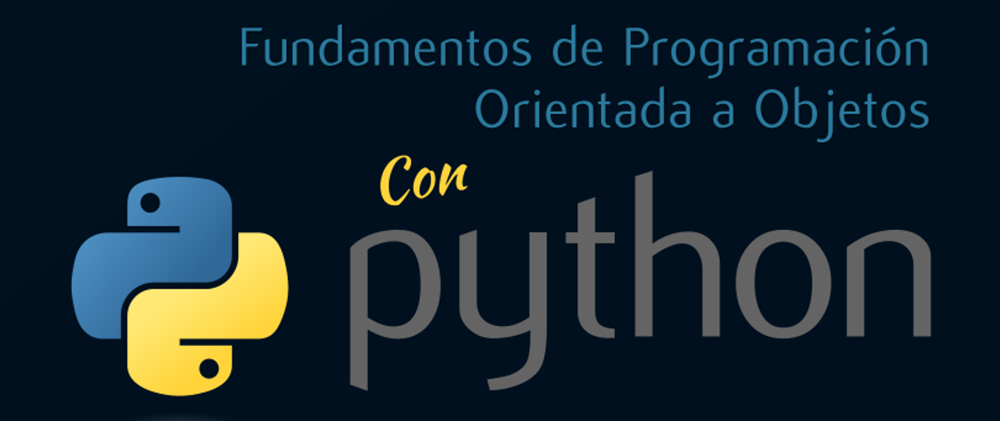

# Fundamentos de Programación Orientada a Objetos con Python

Bienvenido al repositorio del curso de Fundamentos de Programación Orientada a Objetos con Python. Este curso tiene como objetivo principal introducirte al lenguaje de programación Python, enfocándose en la programación orientada a objetos. Aquí encontrarás todos los proyectos y ejercicios realizados durante el curso.

## Índice de Contenidos

1. [Listas y Diccionarios](./diccionarios/notas.py) - Gestión de Diccionarios y Listas.

## Descripción de Ejercicios

- **Listas y Diccionarios**: Programa que permite registrar estudiantes y sus respectivas notas (3 notas), puede modificarlas y finalmente calcula la nota final.

